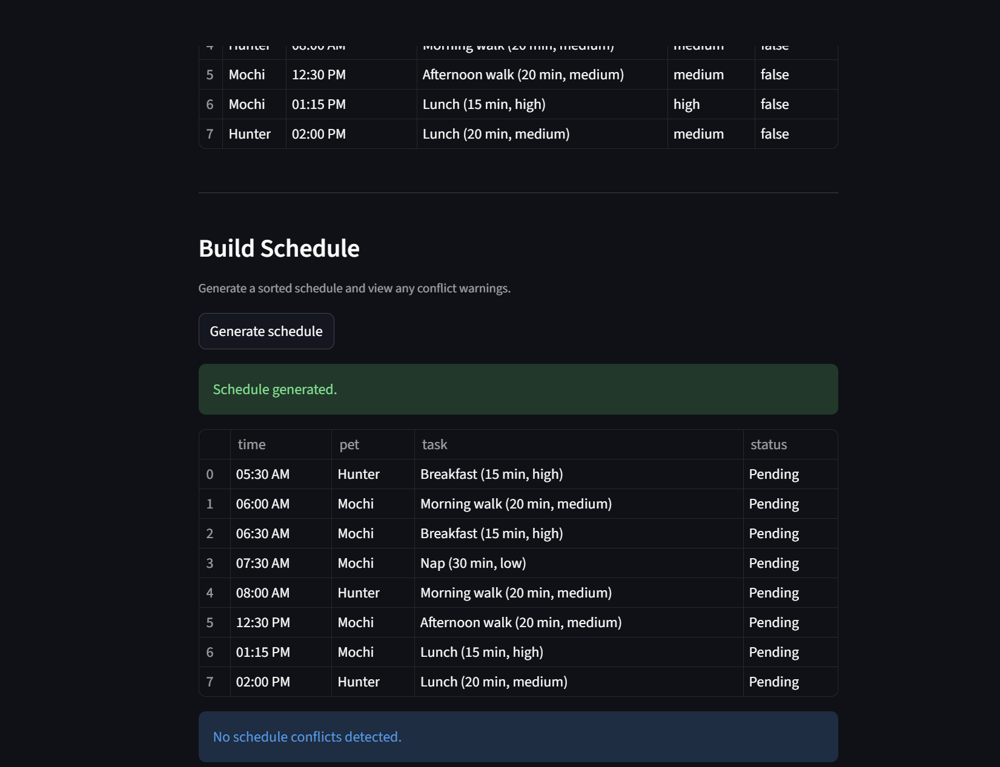

# PawPal+ (Module 2 Project)

You are building **PawPal+**, a Streamlit app that helps a pet owner plan care tasks for their pet.

## Scenario

A busy pet owner needs help staying consistent with pet care. They want an assistant that can:

- Track pet care tasks (walks, feeding, meds, enrichment, grooming, etc.)
- Consider constraints (time available, priority, owner preferences)
- Produce a daily plan and explain why it chose that plan

Your job is to design the system first (UML), then implement the logic in Python, then connect it to the Streamlit UI.

## Smarter Scheduling
- In order to make the PawPal+ application more functional and intelligent, three new features were added regarding to sorting, filtering, and detecting conflicts when inserting tasks. Firstly, all tasks were sorted by time to ensure chronological order, and to determine which task is next after the other. 


## Testing PawPal+
- Pytests were generated to ensure the accuracy and proper functionality of the overall program. Some tests that are covered were for checking the proper sorting, verifying that all tasks were returned in chronological order, confirming that marking a daily task complete creates a new task for the following day, and verifying that the scheduler class method will flag and give out a warning when duplicate times are inserted in the app. Running the command to run the tests, "python -m pytest", will display and show that all tests pass, and show that the functionality of the app is well.

- The overall confidence level I give in the systems reliability based on my test results, would be a 4.


Features List:

- Chronological Task Sorting
Sorts all tasks by scheduled datetime so tasks display in time order across all pets using pawpal_system.py:169.

- Completion-State Sorting
Sorts tasks by completion status (pending first, completed after) using a boolean-key sort in pawpal_system.py:153.

- Recurrence Generation on Completion
When a recurring task is marked complete, the system creates the next occurrence automatically:

Daily: +1 day
Weekly: +7 days
- Implemented in pawpal_system.py:176 with recurrence rules in pawpal_system.py:119.
Frequency Normalization
- Recurrence frequency is normalized with trim + lowercase before rule matching, so values like “Daily” and “ daily ” are treated consistently in pawpal_system.py:119.

- Idempotent Completion Behavior
Prevents duplicate recurrence creation by exiting early if a task is already complete in pawpal_system.py:177.

- Exact-Time Conflict Detection
Detects schedule conflicts by grouping tasks into a dictionary keyed by exact datetime, then flags any slot with 2+ tasks in pawpal_system.py:201.

- Same-Pet vs Multi-Pet Conflict Messages
Produces different warning text depending on whether overlap is within one pet or across multiple pets in pawpal_system.py:217.

- Task Filtering Pipelines
Supports quick filtering into pending and completed task lists via list comprehensions in pawpal_system.py:141 and pawpal_system.py:145.

- Task Grouping by Pet
Builds a pet-to-task mapping for display and traversal in pawpal_system.py:135.

- Duplicate Task Insert Guard (Per Pet)
Prevents adding the same task object twice to a pet using membership checks in pawpal_system.py:64.

## Screenshots

<a href="streamlitapp.png" target="_blank">
  
</a>

## What you will build

Your final app should:

- Let a user enter basic owner + pet info
- Let a user add/edit tasks (duration + priority at minimum)
- Generate a daily schedule/plan based on constraints and priorities
- Display the plan clearly (and ideally explain the reasoning)
- Include tests for the most important scheduling behaviors

## Getting started

### Setup

```bash
python -m venv .venv
source .venv/bin/activate  # Windows: .venv\Scripts\activate
pip install -r requirements.txt
```

### Suggested workflow

1. Read the scenario carefully and identify requirements and edge cases.
2. Draft a UML diagram (classes, attributes, methods, relationships).
3. Convert UML into Python class stubs (no logic yet).
4. Implement scheduling logic in small increments.
5. Add tests to verify key behaviors.
6. Connect your logic to the Streamlit UI in `app.py`.
7. Refine UML so it matches what you actually built.
